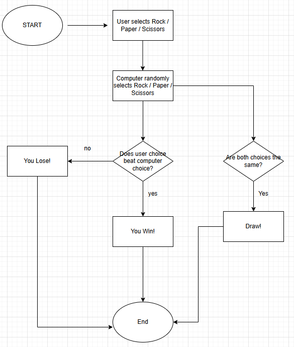
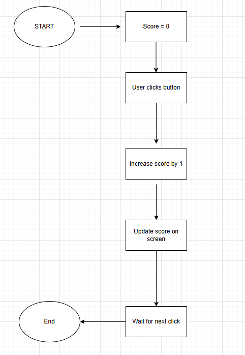

# RevoFun

A mini **game hub website** built using **HTML, CSS, and JavaScript**.
This project is showcasing theree simple browser games and demonstartes core front-end developlemt concepts
such as layout, styling, interactiivity, and basic game logic.

link: https://revou-fsse-oct25.github.io/milestone-2-Daus2701/

# Overview

**RevoFun** is a beginner web project that mandatory for us as a **RevoU** students, to complete our 
**Milestones 2** in pursuing our bootcamp in **RevoU**.
This website includes:
- A landing page with game previews
- Three playable games
- About and Contact pages
- Shared layout, background image, header, and footer

# Games Included

1. Guess the Number
2. R-P-S
3. The Clicker
Each game has its own **HTML** and **JavaScript** file for better organization.

# flow charts

  Guess the Number

  

  R-P-S

  

  The Clicker

  

# Technologies Used

- HTML - Page structure
- CSS3 - Styling, Grid, Flexbox
- JavaScript (ES6) - Game logic & interactivity
  

I admit that in this project I am not doing my best to complete it, any mistakes and errors in this project
will be my concern in the future and I hope that I still have the courage to keep learning and improving

# Author
Subarqah Firdhaus Hardiansyah
REVOU FSSE Madrid

© 2025 RevoFun, Inc. All Rights Reserved.